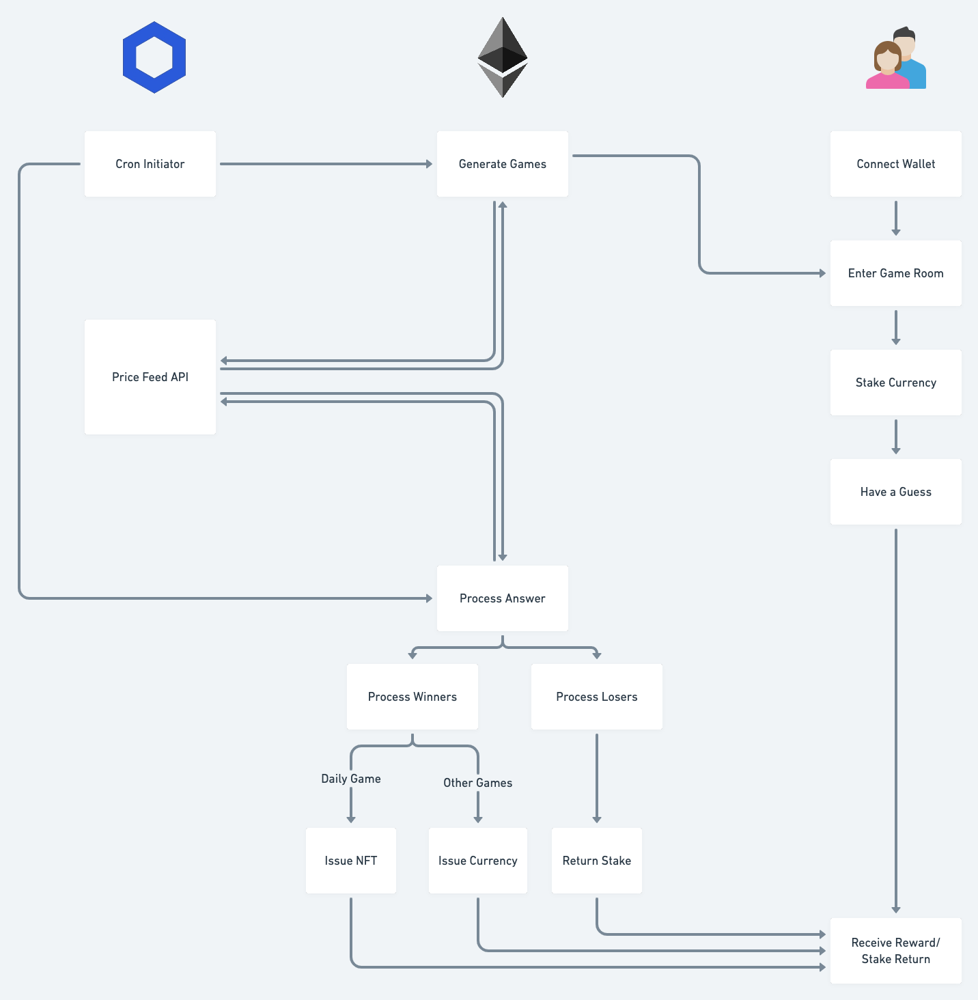

# Guess, Get Gas
A decentralized game powered by Chainlink and Ethereum.

Guess and Learn!
Guess, Get Gas is a guessing game that introduces pieces of information on crypto currencies whilst participants can make guesses on crypto markets in a fun way! Make a correct guess to earn crypto currency or NFT in return. Guess, Get Gas thrives to promote the world of blockchain. :sunglasses:

The world is starting to realize blockchain world, and there are lots of people who haven't learned about it yet. We chose this topic as our starting point to design different kinds of prediction questions for users to guess, in the mean while learning about crypto currencies. 

## What it does

Our smart contracts grabs apis via Chainlink oracles, generating different kinds of questions about crypto currencies, such as the second digit of ETH's price.

For a daily game, you can enter the game for unlimited times if you stake a certain amount of crypto currency, and earn different kinds of NFTs when you win.

For weekly/monthly games, you get to decide your entrance stake, and win a certain amount of prize in proportion to your entrance stake.

The most fascinating game is the lifetime game, the guessing target will be an event that will hardly ever happen, but when it happens, you earn a massive prize, and the only secret of winning is patience.

## How we built it
This application is built using truffle, nodejs, solidity, and chainlink, infura, Remix, web3, polygon.

## Architecture diagram



## Demo video

<p align="center">
   <a target="_blank" href="">
    
   </a>
</p>

## How to install

```sh
# install packages. 
npm install

# compile contracts
truffle compile

# deploy on to Mumbai testnet
truffle migrate --reset --network matic

# start local server
npm run start
```

Once the application is running it can be accessed by local URL http://localhost:3000/


## Challenges we ran into

1. At first, price feed results of chainlink oracle only works on kovan, then we encountered that nodes on kovan is unstable, which leads to uncertain result.
2. Hard to debug.
3. Trouble handling mapping, array, struct.
4. Data type handling is challenging.
5. Trying to but often ran out of gas while deploying, might be because our program design weren't so Ethereum friendly.


## Accomplishments that we are proud of

Starting from newbies of Solidity and Blockchain development world, we are proud to say we learned how to write smart contracts, we tried our best to design UI, and learned a whole lot during this hackathon(great workshops!). Although there are still some parts to fill in, it is our great accomplisment to put together a Dapp and some smart contracts!

## What we learned

We've learnt the basic flow of a smart contract, the usage of chainlink oracles, deployments and different testnets, how to mint a NFT, how to implement wallet connection...etc.

## What's next for Guess, Get Gas

After a crypto version of GGG, we hope to integrate with open apis of other fields, such as NASA api, weather api etc., to enrich our questions with different kinds of topics, making GGG an entertaining and yet knowledgeable Dapp.

* Add more fields of questions, including weather api, NASA api etc., to enrich our questions database.
* Improve profile page to show personal winning and current balance.
* Improve UI/UX.
* Integrate compound api to generate interest.
* Integrate cron initiators to generate questions.
